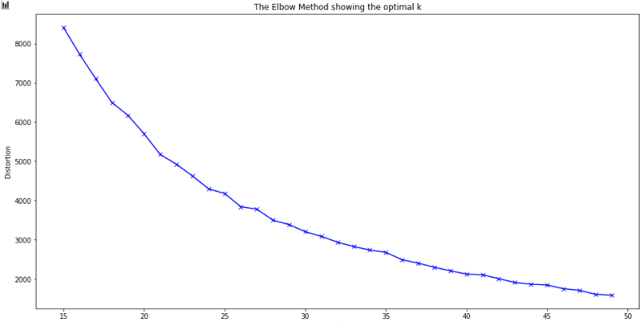

# clustering

The objective of this project is to learn the different methods of clustering.
To do this, we use a dataset containing the positions of chipotle restaurants in the United States. We are trying to find the location with the highest concentration of restaurants.

### *Links to documentation :*
- [GeoPandas](https://geopandas.org/)  
- [Sickit-learn](https://scikit-learn.org/stable/index.html)  

## How to Determine the Optimal numbers of clusters
We use the elbow method and the silhouette method  

  

With these 2 graphs we decided that the optimal number of clusters was 37.

## The map
  

## How to choose the best place to live
To choose the place with the most restaurants, we drew a circle around the centroids and looked for the one with the most restaurants.

In conclusion, the place with the most "chipotle" is xxx

  

  

### The team    
[Fred](https://github.com/becodefred)  
[Guillaume](https://github.com/guigem)  
[Melvin](https://github.com/Melvin-Leroy)  
[Axelle](https://github.com/GodIsADJ)

